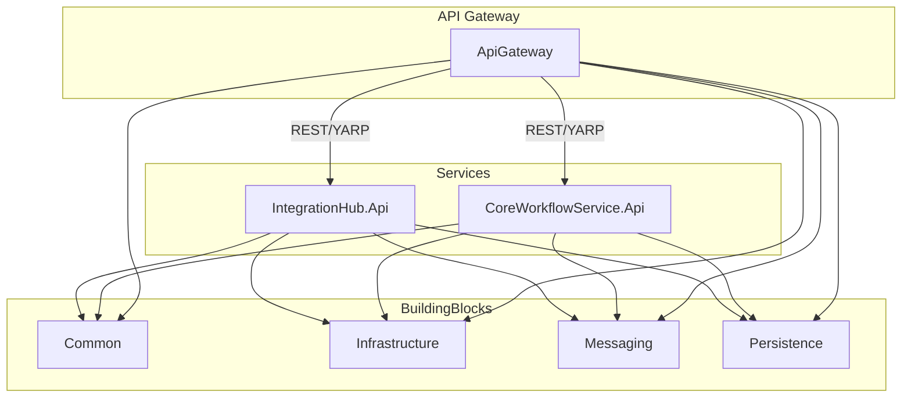

# Architecture Diagram (Acme Platform API)

**Legend:**

- `ApiGateway`: Entry point, routing, security, and aggregation
- `IntegrationHub.Api` / `CoreWorkflowService.Api`: Bounded context services
- `BuildingBlocks`: Shared libraries for common, infrastructure, messaging, and persistence concerns

---

_This diagram is a high-level overview. For detailed flows, see sequence diagrams._
