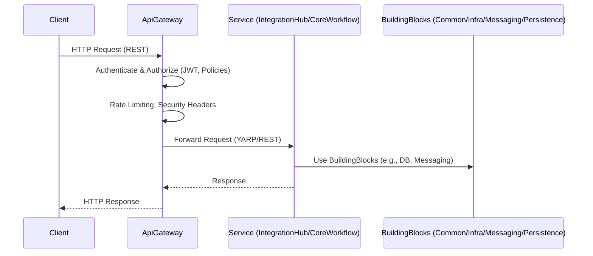

# Sequence Diagram: API Request Flow (Acme Platform)

**Legend:**

- `ApiGateway`: Handles security, routing, and aggregation
- `Service`: Bounded context (IntegrationHub or CoreWorkflow)
- `BuildingBlocks`: Shared libraries for cross-cutting concerns

---

_This diagram shows a typical request flow from client to service and back, including security and infrastructure steps._
